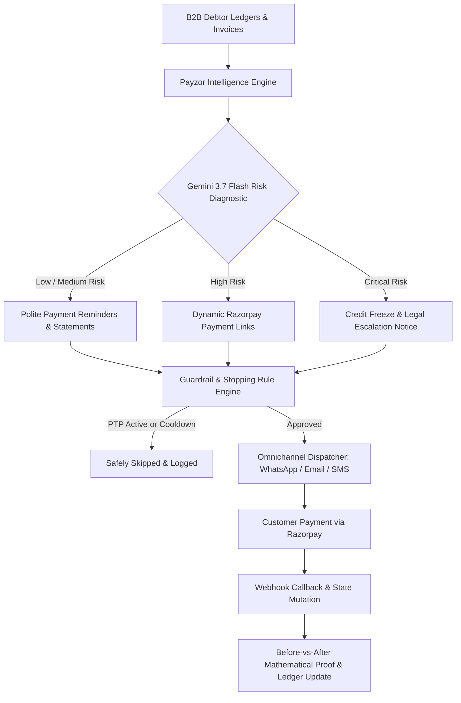

<div align="center">

# ⚡ Payzor AI — Autonomous Revenue Recovery & Receivables Command Platform
### *Enterprise Receivables Intelligence, Autonomous Dunning & Real-Time Risk Orchestration*

[](https://fastapi.tiangolo.com)
[](https://reactjs.org/)
[](https://ai.google.dev/)
[](https://threejs.org/)
[](https://www.postgresql.org/)
[](https://razorpay.com/)

<br />

**Payzor AI** transforms passive overdue invoices into an active, compliant, AI-driven revenue recovery engine. It combines real-time delinquency behavioral analysis, multi-channel dunning (WhatsApp, Email, SMS, RCS), dynamic payment link generation, and mathematical before-vs-after ledger mutation verification.

---

</div>

## 🌟 Key Highlights & Razorpay Track 03 Architecture

* 🛡️ **Autonomous AI Revenue Recovery**: Detects at-risk receivables and executes automated dunning workflows with built-in financial guardrails.
* 🧠 **Gemini 3.7 Flash Reasoning**: Natural language audience segmentation, personalized multi-channel copy generation, and predictive delinquency risk scoring.
* 🛑 **Strict Ethical Stopping Rules**:
  * **Zero-Touch for PTP**: Accounts with active Promise-to-Pay are automatically shielded from outreach.
  * **Instant Settlement Halt**: Reminders cease the millisecond a payment link callback or invoice settlement occurs.
  * **24-Hour Cooldown & Touch Frequency Limits**: Guarantees zero harassment and full regulatory compliance.
* 📊 **Mathematical Before-vs-After Mutation Proof**: Real-time delta visualization comparing pre-recovery vs post-settlement outstanding balances, overdue totals, and delinquency risk scores.
* 💬 **Autonomous Cart & Dunning Negotiator**: WhatsApp simulator capable of dynamic settlement discounting within hard profit margin floors.
* 🧪 **Zero-Cost Omnichannel Testing Center**: Built-in channel simulator for WhatsApp, Email, SMS, and RCS with real-time webhooks and latency diagnostics.

---

## 🏛️ System Architecture & Data Flow



---

## 🖥️ Platform Modules

| Module | Description |
| :--- | :--- |
| **Recovery Command Center** | High-level financial KPIs: Total Outstanding Dues, Revenue at Risk, Measured Money Recovered, and top debtor risk profiles. |
| **AI Revenue Recovery Engine** | Action queue, batch review modals, single/batch approval workflows, simulated settlements, and before/after mutation proof. |
| **Audience Builder** | Natural language query box that compiles English statements into strict SQL queries with explainable AI reasoning. |
| **Campaign Studio** | 6-stage dunning workflow builder from goal definition to AI message generation and guardrail verification. |
| **Cart & Invoice Negotiator** | Interactive AI agent on WhatsApp with dynamic price bargaining, margin floor constraints, and instant checkout generation. |
| **Customers & Receivables Ledger** | Comprehensive B2B debtor records, credit line utilization tracks, and invoice histories. |
| **Channel Simulator & Testing Center** | Interactive simulator testing webhook delivery, payload inspection, and simulated network latencies. |

---

## 🚀 Quickstart Guide

### Prerequisites
* **Python 3.10+**
* **Node.js 18+** & **npm**

---

### 1. Backend Setup

```bash
# Navigate to backend directory
cd backend

# Create and activate virtual environment
python -m venv venv

# Windows:
.\venv\Scripts\activate
# macOS/Linux:
source venv/bin/activate

# Install dependencies
pip install -r requirements.txt

# Configure Environment (.env)
cp .env.example .env
```

Ensure your `.env` contains:
```env
DATABASE_URL=sqlite:///./payzor.db
GEMINI_API_KEY=your_gemini_api_key_here
GEMINI_MODEL=gemini-3.7-flash
CHANNEL_SERVICE_URL=http://localhost:8001
CRM_WEBHOOK_URL=http://localhost:8000/webhook
```

```bash
# Seed initial test debtors and invoices
python scripts/seed_customers.py
python scripts/seed_orders.py

# Start FastAPI server (Port 8000)
python -m uvicorn app.main:app --port 8000 --reload
```

---

### 2. Channel Simulator Service (Port 8001)

```bash
# In backend directory with virtual environment activated:
python -m uvicorn channel_service.main:app --port 8001 --reload
```

---

### 3. Frontend Setup

```bash
# Navigate to frontend directory
cd frontend

# Install Node dependencies
npm install

# Start Vite Development Server (Port 3001)
npm run dev
```

Open [http://localhost:3001](http://localhost:3001) in your browser.

---

## 🔐 Default Demo Credentials

* **Email:** `admin@payzor.ai`
* **Password:** `admin123`
* **Organization:** `Payzor Capital & Recovery Technologies`

*(A one-click "Demo Admin: admin@payzor.ai Auto-Fill" button is available on the login page)*

---

## 🛠️ Technology Stack

* **Frontend:** React 19, Vite, Three.js, Lucide Icons, Framer Motion, Vanilla CSS (Obsidian Black & Metallic Gold Theme)
* **Backend:** FastAPI (Python 3.11), SQLAlchemy, Pydantic v2, Uvicorn
* **AI Engine:** Google Gemini 3.7 Flash API
* **Database:** PostgreSQL / SQLite
* **Channel Infrastructure:** Async Webhook Simulator (WhatsApp, Email, SMS, RCS)

---

## 📄 License
This project was developed exclusively for the **Razorpay Hackathon Track 03 (Autonomous Revenue Recovery)**.
Proprietary & Confidential © 2026 Payzor AI.
