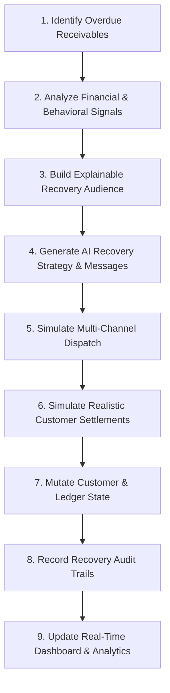

# Payzor AI — Backend Services
### High-Performance AI Revenue Recovery Engine

The **Payzor AI** backend is an asynchronous, enterprise-grade REST API engineered for Autonomous B2B Revenue Recovery. Designed for enterprises operating on trade credit terms (e.g., 30, 45, or 60 days), the system replaces manual collection operations with automated receivables monitoring, multi-dimensional AI risk scoring, explainable delinquent cohort segmentation, personalized payment-recovery messaging, and simulated payment-link settlements.

---

## ⚠️ Demo & Simulation Architecture

> **ENTERPRISE SCOPE & ARCHITECTURE**:
> - **B2B Revenue Recovery Focus**: Payzor AI is purpose-built for managing B2B receivables, credit terms, and overdue accounts.
> - **Simulation Mode**: Outreach dispatches (WhatsApp, SMS, Email) and customer payment settlements are processed via a dedicated **Channel Service Simulator** and asynchronous webhook pipeline. In this demo environment, no real SMS/WhatsApp messages are transmitted to personal devices, and no real monetary transactions take place.

---

## 🔄 The 9-Stage AI Revenue Recovery Flow



1. **Receivables Identification**: Continuously queries the customer ledger to detect accounts crossing payment due dates across aging buckets (1–30, 31–60, 61–90, 90+ days).
2. **Multi-Signal Risk Analysis**: Calculates composite risk scores based on overdue velocity, historical default frequency, credit utilization, and communication sentiment.
3. **Audience Segmentation**: Assembles targeted recovery cohorts using either structured rule filters or natural language prompts.
4. **AI Strategy & Message Drafting**: Invokes server-side Groq (`qwen/qwen3.8-27b`) to formulate tone-tailored collection notices containing contextual checkout payment links (`checkout.payzor.ai`).
5. **Simulated Dispatch**: Orchestrates batch transmission through the Channel Simulator service.
6. **Settlement Resolution**: Simulates customer responses, payment-link interactions, and partial or full payment completions.
7. **Ledger Reconciliation**: Atomically updates customer outstanding dues, invoice statuses, and balance ledgers in the database.
8. **Audit Logging**: Persists comprehensive `RecoveryAudit` and `RecoveryBatch` records detailing before/after balance changes.
9. **Analytics Propagation**: Propagates updated metrics to the Executive Dashboard, recovery timeline graphs, and collection rate analytics.

---

## 🏛️ Architecture & Core Services

The backend follows a modular, domain-driven service architecture:

```
backend/
├── app/
│   ├── models/              # SQLAlchemy ORM database models
│   │   ├── campaign.py          # Recovery campaign definitions & metadata
│   │   ├── copilot_conversation.py # LLM Copilot chat sessions
│   │   ├── copilot_message.py   # Copilot conversation turns
│   │   ├── customer.py          # B2B customer master & credit terms
│   │   ├── event.py             # System & customer event stream
│   │   ├── message.py           # Outreach communication records
│   │   ├── negotiation.py       # Settlement & discount agreements
│   │   ├── order.py             # Invoices and credit order items
│   │   ├── recovery_audit.py    # Immutable audit trail of recovered balances
│   │   ├── recovery_batch.py    # Batch execution summaries & stats
│   │   ├── security.py          # Audit logs for auth & security events
│   │   └── user.py              # User authentication & RBAC models
│   ├── routes/              # FastAPI APIRouters
│   │   ├── analytics.py         # Receivables aging & recovery performance
│   │   ├── audience.py          # Natural language cohort compilation
│   │   ├── auth.py              # JWT authentication, registration & verification
│   │   ├── campaigns.py         # AI campaign creation, execution & preview
│   │   ├── copilot.py           # Financial Copilot multi-turn reasoning
│   │   ├── customers.py         # Customer ledger management & PTP registration
│   │   ├── dashboard.py         # High-level executive KPI aggregations
│   │   ├── negotiator.py        # Autonomous settlement & concession engine
│   │   ├── orders.py            # Invoice creation & order tracking
│   │   ├── recovery.py          # Autonomous recovery engine & queue actions
│   │   ├── testing.py           # Database seeding & demo simulation utilities
│   │   └── webhook.py           # Webhook receiver for payment events
│   ├── services/            # Core business logic & external integrations
│   │   ├── analytics_service.py # Time-series aggregation & cohort analytics
│   │   ├── audience_service.py  # Rule compiler & debtor filtering logic
│   │   ├── campaign_service.py  # Dunning generation & dispatch runner
│   │   ├── customer_service.py  # Ledger mutations & credit calculations
│   │   ├── groq_service.py      # Groq LLM integration & prompt engineering
│   │   ├── guardrail_service.py # 24h cooldown, PTP & threshold enforcement
│   │   ├── negotiation_service.py # Settlement negotiation agent
│   │   ├── order_service.py     # Invoice lifecycle & due date tracking
│   │   ├── recovery_service.py  # Autonomous scoring & action prioritization
│   │   └── webhook_service.py   # Webhook dispatch to Channel Simulator
│   ├── utils/               # Shared utilities
│   │   ├── auth_utils.py        # Password hashing & JWT generation
│   │   └── email_service.py     # Email verification & notification helper
│   ├── config.py            # Pydantic environment settings & secrets
│   ├── database.py          # SQLAlchemy engine & session factory (payzor.db)
│   └── main.py              # FastAPI application factory & middleware
├── channel_service/         # Microservice simulating external channels
│   └── main.py              # Dispatch & settlement webhook endpoints
└── requirements.txt         # Python package dependencies
```

---

## ⚡ Setup & Execution

### 1. Install Dependencies
```bash
python -m venv venv
# Windows:
.\venv\Scripts\activate
# Linux/macOS:
source venv/bin/activate

pip install -r requirements.txt
```

### 2. Environment Variables
Copy `.env.example` to `.env` and configure:
```env
DATABASE_URL=sqlite:///./payzor.db
SECRET_KEY=payzor_recovery_secret_key_secure_32bytes_token_sha256
GROQ_API_KEY=your_groq_api_key_here
```

### 3. Run the Server
```bash
uvicorn app.main:app --reload --port 8000
```
API Documentation: `http://localhost:8000/docs`
