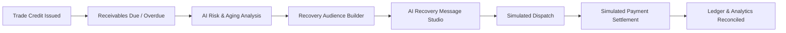

# Payzor AI — Frontend Web Client
### Ultra-Premium AI Revenue Recovery & Receivables Command Center

The **Payzor AI** frontend is a high-performance, responsive Single Page Application (SPA) built for enterprises managing credit lines, overdue receivables, and automated revenue recovery.

Styled in an ultra-premium **Obsidian Black and Metallic Gold** fintech aesthetic, the platform provides financial operations, credit managers, and CFOs with an intuitive command center to monitor delinquent risk signals, compile natural-language recovery cohorts, synthesize personalized multi-channel dunning notices, and simulate payment settlements.

---

## 🎨 Design System: Obsidian Black & Metallic Gold

The user interface is engineered with a bespoke luxury fintech design system:
- **Obsidian Black Surface Layer**: `#0A0A0B`, `#0D0E12`, `#121318`
- **Metallic Gold Accents**: `#D4AF37`, `#FFD700`, `#E5C158`, `#F3E5AB`, `#C5A059`
- **Glassmorphic Cards**: `background: rgba(18, 19, 24, 0.85); border: 1px solid rgba(212, 175, 55, 0.18)`
- **Quantum 3D Scene**: Three.js shimmering golden particles, rotating orbital nodes, and ambient glowing shaders.

---

## 🔄 End-to-End User Journey



1. **Credit Terms & Invoicing**: Customers hold credit lines with defined payment terms.
2. **Aging & Delinquency Detection**: Tracks receivables across 1–30, 31–60, 61–90, and 90+ day aging buckets.
3. **AI Risk Assessment**: Multi-signal analysis evaluates overdue velocity, credit exposure, and previous payment reliability.
4. **Cohort Segmentation**: The Audience Builder filters delinquent accounts via SQL rules or conversational prompts.
5. **Contextual Recovery Messaging**: AI synthesizes tone-adapted recovery messages with secure checkout links (`checkout.payzor.ai`).
6. **Dispatch Simulation**: Campaigns execute via the backend simulation engine.
7. **Settlement & Ledger Reconciliation**: Simulated payments trigger instant ledger updates, adjusting outstanding balances in real time.

---

## 🌟 User-Facing Modules

### 1. Receivables Command Center (`CrmDashboard.jsx`)
* Real-time KPIs: Total Outstanding Receivables, Overdue Invoices, At-Risk Capital, and 30-Day Recovery Velocity.
* Aging bucket breakdowns (1–30, 31–60, 61–90, 90+ days).
* Priority collection queue highlighting accounts requiring immediate intervention.

### 2. Customers & Ledgers (`CrmCustomers.jsx`)
* Complete debtor directory with credit limits, terms, payment reliability scores, and current balances.
* Detailed transactional ledger drilldown: invoice history, payment receipts, aging status, and Promise-to-Pay registration.

### 3. AI Revenue Recovery Hub (`CrmRevenueRecovery.jsx`)
* Centralized recovery control room with automated action queues.
* Dynamic risk matrix scoring accounts as Low, Moderate, High, or Severe risk.
* Direct action controls: Trigger AI strategy generation, preview payment links, or execute recovery batches.

### 4. Recovery Audience Builder (`CrmAudienceBuilder.jsx`)
* Rule-based and natural language audience segmentation.
* Real-time audience size estimation and exposure calculation before campaign execution.

### 5. AI Campaign Studio (`CrmCampaignStudio.jsx`)
* 6-step guided wizard for configuring and launching multi-channel recovery sequences.
* Multi-channel preview (WhatsApp, Email, SMS) with compliant dunning copy.

### 6. Payzor AI Financial Copilot (`CrmCopilot.jsx`)
* Conversational AI analyst providing instant portfolio answers, aging breakdowns, and recovery projections.

---

## ⚡ Quick Start

```bash
cd frontend
npm install
npm run dev
```

Application will run at `http://localhost:5173`.
